# Library Management System

This is a simplified Library Management System built as part of an assignment to demonstrate CRUD operations, RESTful API design, database interaction, and frontend development.

## 📹 Project Explanation Video
🎥 **Video Link**: [Watch Here](https://drive.google.com/file/d/186Ari4mFjpEzOMzyMHTbCZqTsJEOAu4f/view?usp=drive_link)

---

## 📸 Screenshots

### **1. Database Setup**

- **Creating Tables:**

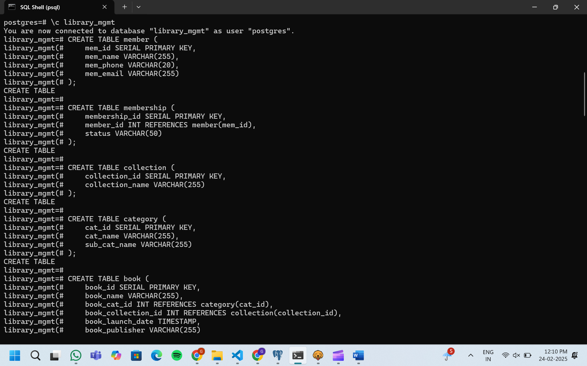

- **Inserting Data:**

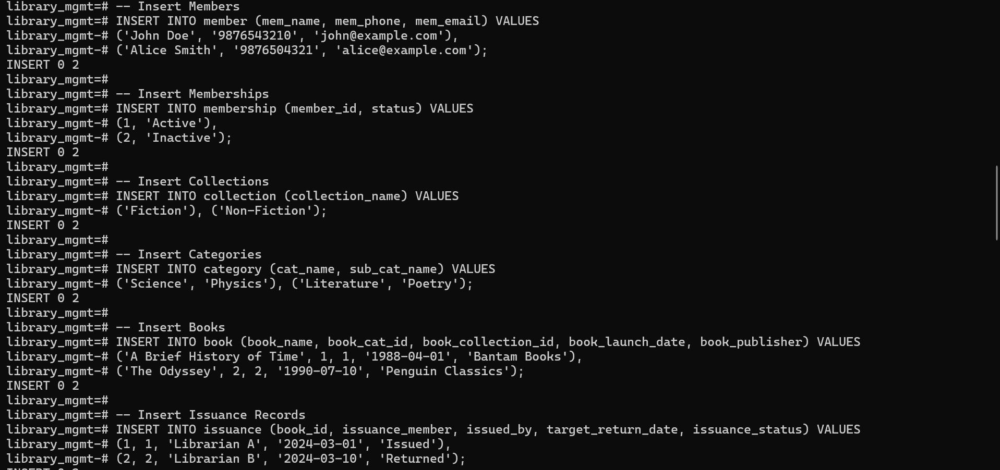

### **2. API Requests**

#### a) **Unauthorized API Request (Without API Key)**

- **Unauthorized API Call:**

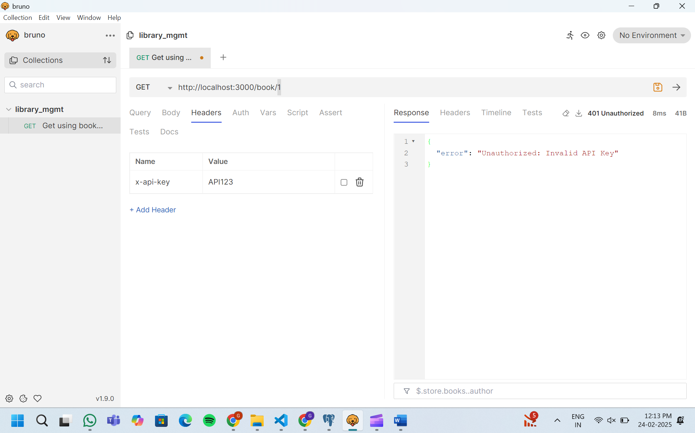

#### b) **Authorized API Request (With API Key)**

- **Authorized API Call:**

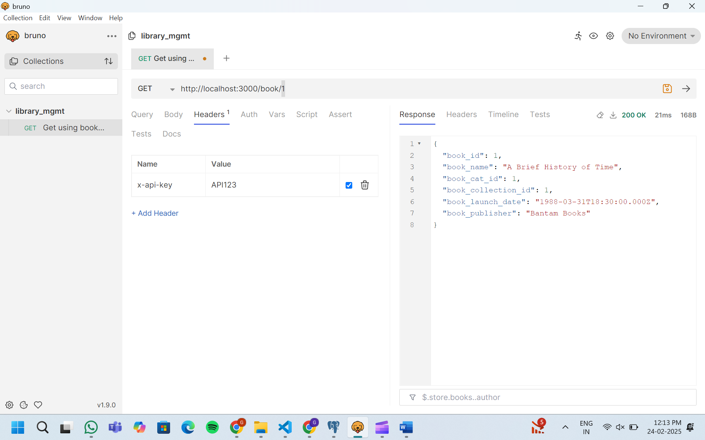

#### c) **Fetching Books Data**

- **Get All Books:**

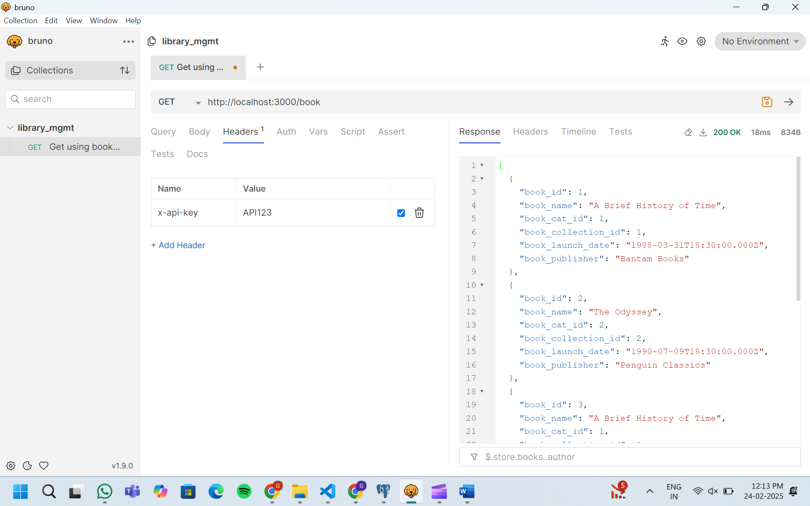

- **Get Book By ID:**


### **3. Frontend Dashboard**

- **Frontend Dashboard: Filtering Books by Date**

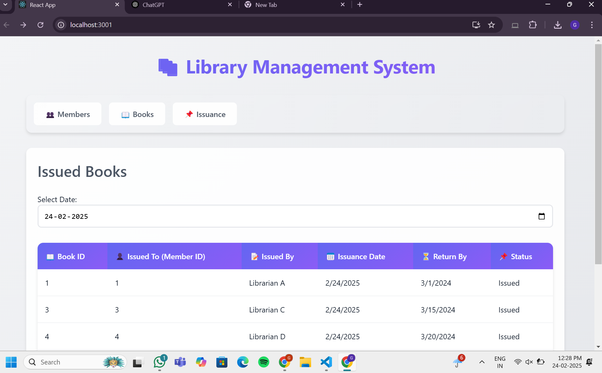


- **Members Dashboard:**

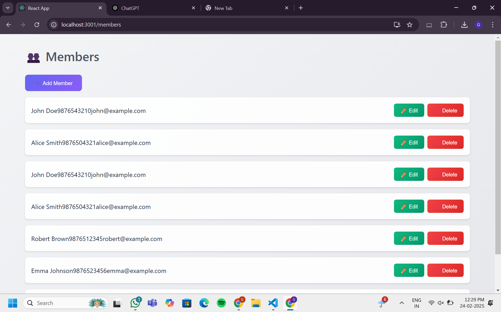

- **Books Dashboard:**

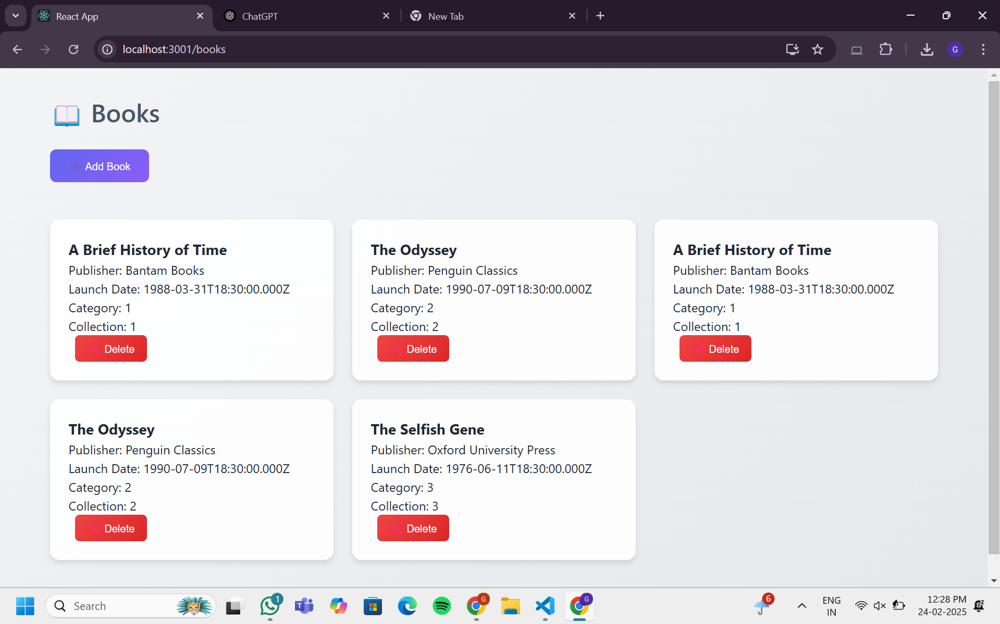

- **Issuance Dashboard:**

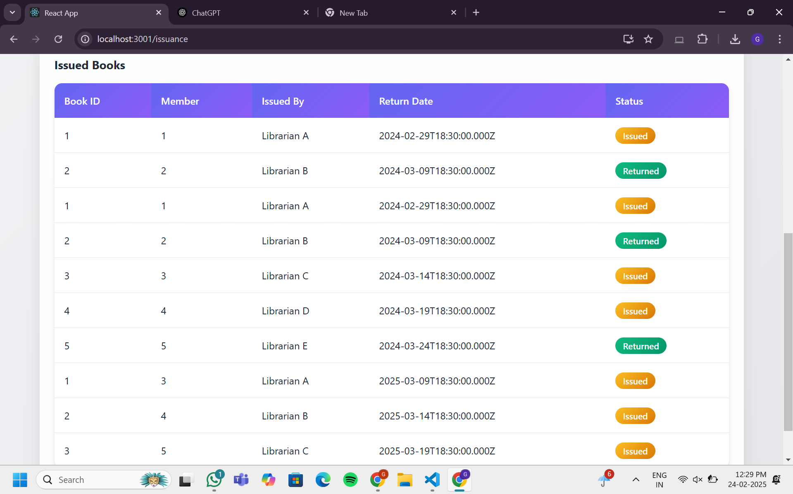

### **4. Functionality Demonstrations**

- **Adding a Book:**

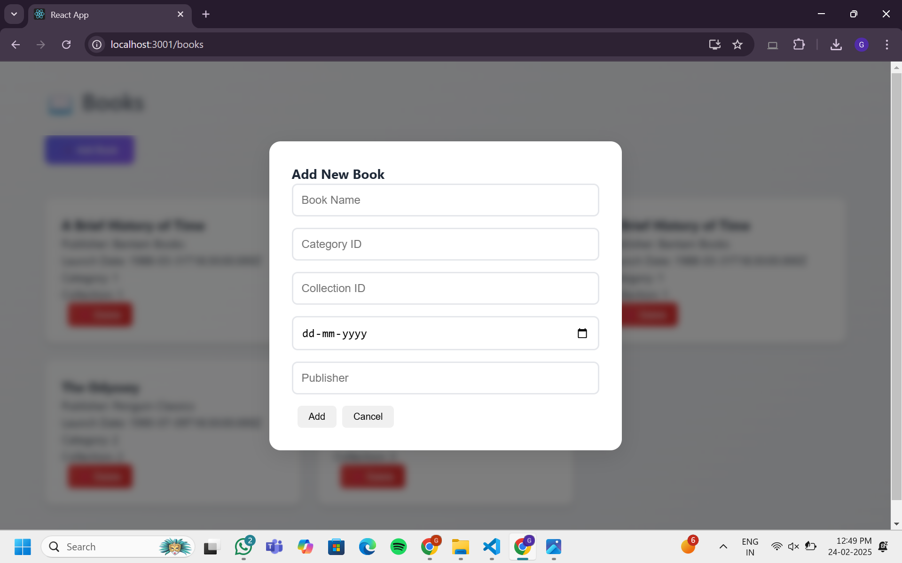

- **Editing a Member:**

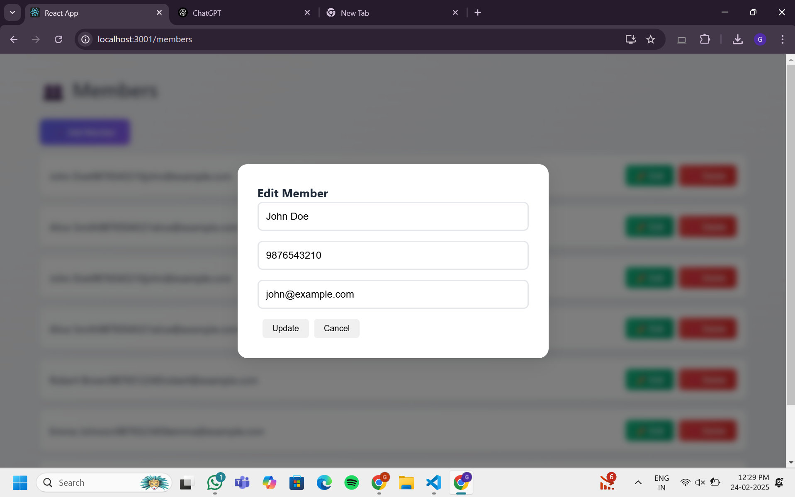

---

## ✨ Features

* **Member Management:**
    - View, Add, Edit, and Delete members.
* **Book Management:**
    - View, Add, and Delete books.
* **Issuance Management:**
    - Issue new books to members.
    - Track book issuance and return status.
* **Dashboard:**
    - Simple dashboard showing issued books and the ability to filter books by date.
* **API Key Authentication:**
    - Basic API Key security to prevent unauthorized access to the API endpoints.

---

## 🛠 Technologies Used

### **Backend**
- Node.js
- Express.js
- PostgreSQL
- pg (PostgreSQL client for Node.js)
- dotenv (for managing environment variables)
- cors (for handling Cross-Origin Resource Sharing)

### **Frontend**
- React
- Axios (for making API requests)

### **Development Tools**
- Visual Studio Code (VS Code)
- pgAdmin (PostgreSQL administration tool)
- psql (PostgreSQL command-line tool)
- Bruno (API testing tool)

---

## 🏗️ Setup Instructions

### **1. Clone the Repository**

```bash
git clone https://github.com/Gouri1504/library_mgmt_postgreSQL
cd library_mgmt_postgreSQL
```

### **2. Backend Setup**

- **Install Node.js Dependencies:**

  ```bash
  cd backend
  npm install
  ```

- **Configure PostgreSQL Database:**
  - Create a PostgreSQL database named `library_mgmt`.
  - Run the SQL commands in `sql_command.txt` to create the necessary tables.

- **Configure Environment Variables:**
  - Create a `.env` file in the `backend` directory.
  - Add the following credentials:

    ```
    DB_USER=<your_db_user>
    DB_HOST=<your_db_host>
    DB_NAME=library_mgmt
    DB_PASS=<your_db_password>
    DB_PORT=<your_db_port>
    API_KEY=<your_api_key>
    PORT=3000
    ```
    * Replace `<your_api_key>` with a secure API key.

- **Start the Backend Server:**

  ```bash
  npm start
  ```
  The server should now be running on `http://localhost:3000` (or the port you specified in the `.env` file).

### **3. Frontend Setup**

- **Install React Dependencies:**

  ```bash
  cd ../frontend
  npm install
  ```

- **Configure API Base URL and API Key:**

  - Open `frontend/src/App.js`.
  - Modify the `API_KEY` and `API_PORT` variables:

    ```javascript
    const API_KEY = "<your_api_key>"; // Replace with your API key
    const API_PORT = 3000;
    const API_BASE_URL = `http://localhost:${API_PORT}`;
    ```

- **Start the React Application:**

  ```bash
  npm start
  ```
  The frontend should now be running on `http://localhost:3001`.

---

## 🌍 API Endpoints

**Books:**
- `GET /book` → Get all books.
- `GET /book/:id` → Get a book by ID.
- `POST /book` → Create a new book.
- `PUT /book/:id` → Update a book.
- `DELETE /book/:id` → Delete a book.

**Members:**
- `GET /member` → Get all members.
- `GET /member/:id` → Get a member by ID.
- `POST /member` → Create a new member.
- `PUT /member/:id` → Update a member.
- `DELETE /member/:id` → Delete a member.

**Issuance:**
- `GET /issuance` → Get all issuance records.
- `POST /issuance` → Issue a new book.
- `GET /issuance/pending?date=YYYY-MM-DD` → Get pending books for a specific date.

📌 **Note:** All API requests require an `x-api-key` header.

---

## 📊 SQL Queries

### 1️⃣ **Get all books that have never been borrowed:**

```sql
SELECT book_name, book_publisher
FROM book
WHERE book_id NOT IN (SELECT book_id FROM issuance);
```

### 2️⃣ **List the outstanding books at any given point in time:**

```sql
SELECT
    m.mem_name AS Member,
    b.book_name AS "Book Name",
    b.book_publisher AS Author,
    i.issuance_date AS "Issued Date",
    i.target_return_date AS "Target Return Date"
FROM
    issuance i
JOIN
    member m ON i.issuance_member = m.mem_id
JOIN
    book b ON i.book_id = b.book_id
WHERE
    i.issuance_status = 'Issued';
```

### 3️⃣ **Extract the top 10 most borrowed books:**

```sql
SELECT
    b.book_name AS "Book Name",
    COUNT(i.book_id) AS "Number of times borrowed",
    COUNT(DISTINCT i.issuance_member) AS "Number of Members that Borrowed"
FROM
    issuance i
JOIN
    book b ON i.book_id = b.book_id
GROUP BY
    b.book_name
ORDER BY
    COUNT(i.book_id) DESC
LIMIT 10;
```

---

## 🔮 Future Improvements

✔ Implement user authentication and authorization.

✔ Add advanced search capabilities for books and members.

✔ Improve UI design and user experience.

✔ Implement error handling and validation.

✔ Add unit tests for backend API.

✔ Enhance security (e.g., HTTPS, password hashing).

✔ Implement **Edit Functionality** for Books.

---

